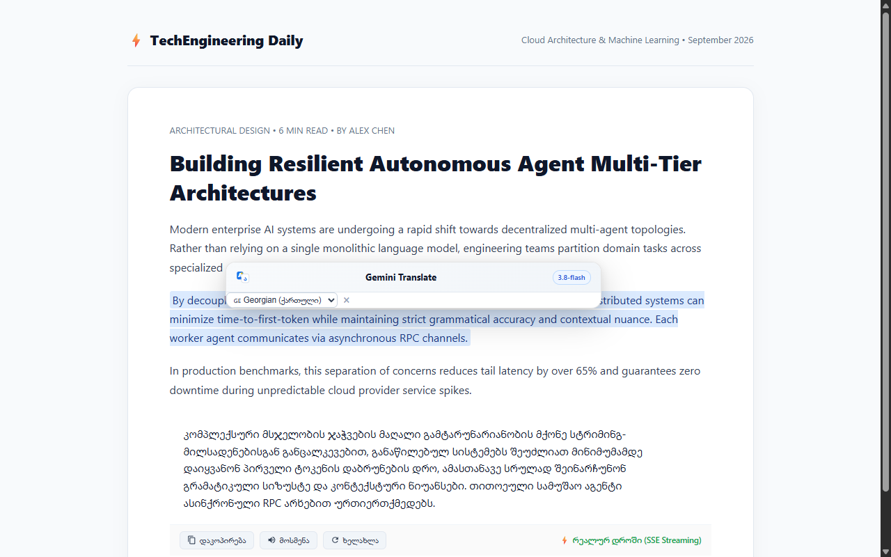
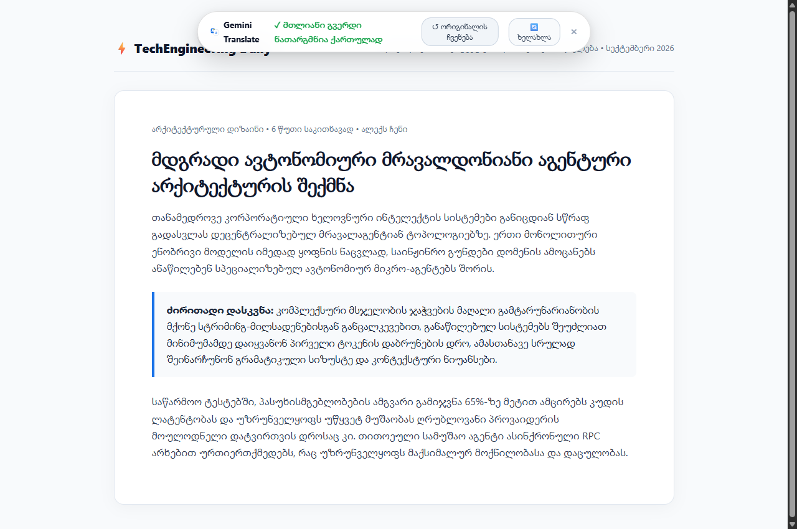
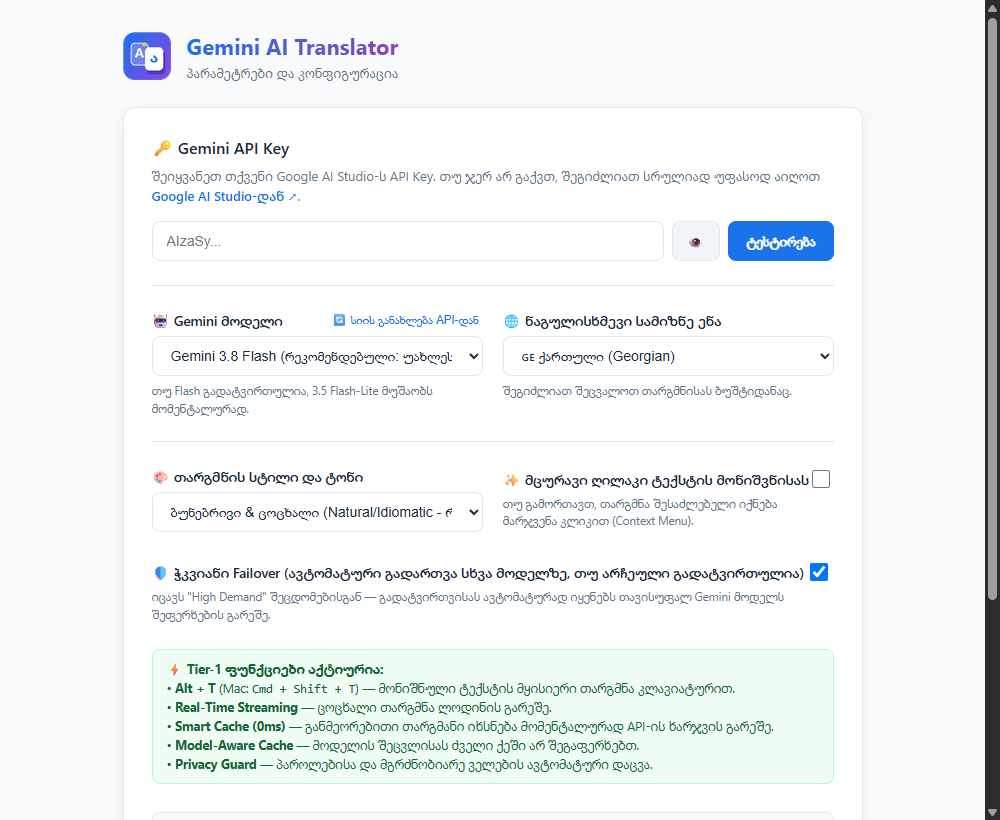

# 🌐 Gemini Web Translator (Chrome & Brave Extension)

[](https://developer.chrome.com/docs/extensions/mv3/intro/)
[](https://ai.google.dev/)
[](#)
[](LICENSE)

**Gemini Web Translator** არის თანამედროვე და სწრაფი ბრაუზერის გაფართოება (Chrome, Brave, Edge), რომელიც **Google Gemini 3.8 & 3.5 Flash** მოდელების მეშვეობით უზრუნველყოფს უცხოური ტექსტების ზუსტ, კონტექსტურ და ბუნებრივ ქართულ თარგმანს — როგორც მონიშნული ფრაგმენტებისთვის, ისე **მთლიანი ვებგვერდებისთვის**.

სტანდარტული მთარგმნელებისგან განსხვავებით, გაფართოება ითვალისწინებს ქართული ენის გრამატიკულ თავისებურებებს, სწორ სინტაქსს და ტექნიკურ ტერმინოლოგიას.

---

## 📸 ინტერფეისის მიმოხილვა

### 1. მონიშნული ტექსტის მყისიერი თარგმნა (Streaming)
ტექსტის მონიშვნისთანავე ჩნდება მცურავი ღილაკი. თარგმანი იწყება მყისიერად, ცოცხალ ნაკადურ რეჟიმში:



### 2. მთლიანი ვებგვერდის თარგმნა ორიგინალური დიზაინის შენარჩუნებით
საიტის ვიზუალური მხარე (სტილები, ღილაკები, ბმულები, კოდის ბლოკები) რჩება უცვლელი. გვერდის თავში ჩნდება პროგრესის პანელი ორიგინალზე სწრაფი დაბრუნების ფუნქციით:



### 3. მოქნილი პარამეტრები და მოდელების არჩევანი
შეგიძლიათ თავად აირჩიოთ სასურველი Gemini მოდელი, თარგმნის ტონი და შეამოწმოთ კავშირი:



---

## ✨ ძირითადი ფუნქციები და უპირატესობები

### 🌐 მთლიანი გვერდის თარგმნა (Full Webpage Translation)
* **DOM TreeWalker არქიტექტურა:** თარგმნის მხოლოდ უშუალოდ ტექსტურ კვანძებს (Text Nodes). საიტის განლაგება (Layout), სტილები (CSS), ღილაკები, ბმულები, კოდის ბლოკები (`<code>`, `<pre>`) და ინტერაქციები რჩება სრულიად ხელუხლებელი.
* **პარალელური Batch დამუშავება:** გვერდის შინაარსი ლოგიკურ ბლოკებად იყოფა და ერთდროულად რამდენიმე ნაკადად მუშავდება, რაც მოცულობითი სტატიების თარგმნასაც კი წამებში ასრულებს.
* **პროგრესის მართვის პანელი:** გვერდის თავში გამოდის კომპაქტური ზოლი, სადაც თარგმნის მიმდინარეობა პროცენტულად (0% → 100%) ჩანს.
* **მყისიერი დაბრუნება (0ms Restore):** ღილაკზე **„ორიგინალის ჩვენება“** დაჭერით საიტი წამის მეასედში უბრუნდება პირვანდელ სახეს — გვერდის გადატვირთვის გარეშე.

### ⚡ ცოცხალი სტრიმინგი (Real-Time SSE Streaming)
* Server-Sent Events (SSE) ტექნოლოგიით პირველი ქართული სიტყვა ეკრანზე **200–300 მილიწამში** ჩნდება.
* მომხმარებელი რეალურ დროში ხედავს, როგორ გადმოიცემა აზრი ქართულად — მოლოდინისა და შეფერხებების გარეშე.

### 🧠 ოპტიმიზებული სისწრაფე (Thinking Optimization)
* Gemini 3-ის სტანდარტული „ფიქრის რეჟიმი“ (Chain-of-Thought) თარგმნისთვის მინიმუმამდეა დაყვანილი (`thinkingLevel: LOW / MINIMAL`), რაც უზრუნველყოფს უმოკლეს პასუხის დროს.

### 🛡️ სარეზერვო გადართვის სისტემა (Multi-Model Failover)
* თუ შერჩეული მოდელი (მაგ. `gemini-3.8-flash`) Google-ის მხარეს დროებით გადატვირთულია, სისტემა ავტომატურად გადაერთვება ულტრა-სწრაფ სარეზერვო მოდელზე (**`gemini-3.5-flash-lite`**).

### 💾 Model-Aware Smart Cache & მყისიერი განახლება (0ms)
* **მოდელზე მიბმული ქეში:** ადრე ნათარგმნი ფრაგმენტები ინახება კონკრეტული მოდელის მიხედვით. პარამეტრებში მოდელის შეცვლისას (მაგ. *Pro*-ზე გადასვლისას), ძველი მოდელის ქეში არ შეგაფერხებთ და ახალი მოდელი თავიდან თარგმნის.
* **„🔄 ხელახლა“ ღილაკი:** როგორც მონიშნული ტექსტის ფანჯარაში, ისე მთლიანი გვერდის ბანერში ჩაშენებულია ხელახლა თარგმნის ღილაკი, რომელიც მომენტალურად აიგნორირებს ქეშს (`bypassCache`) და ტექსტს თავიდან აგენერირებს.
* **ქეშის მართვა:** პარამეტრების გვერდიდან (`Options`) შესაძლებელია დაგროვილი ქეშის რაოდენობის ნახვა და ერთი კლიკით სრული გასუფთავება.

### 🇬🇪 ქართული ენის მაღალი სტანდარტი
* **ბუნებრივი სინტაქსი:** ტექსტი არ ითარგმნება მექანიკურად; დაცულია ქართული ენის წყობა, ერგატიული კონსტრუქციები და აზრობრივი ლოგიკა.
* **ტექნიკური ტერმინოლოგია:** უცხოური აკრონიმებისა და ბრენდების სახელები ბრუნდება სწორად (მაგ. *API-ს, Docker-ის, CI/CD-ის, AWS-ზე*).
* **სუფთა შედეგი:** პასუხში არ გვხვდება ზედმეტი ხელოვნური ფრაზები (მაგ. *„აი თქვენი თარგმანი:“*).
* **ქართული ტიპოგრაფია:** გამოყენებულია მართებული ქართული ბრჭყალები („...“).

### 🔒 უსაფრთხოება და კონფიდენციალურობა
* პაროლის ველები (`input[type="password"]`) და სხვა მგრძნობიარე ელემენტები ავტომატურად იგნორირებულია.
* თქვენი API გასაღები ინახება **მხოლოდ თქვენს ბრაუზერში** (`chrome.storage.sync`) და პირდაპირ უკავშირდება Google-ის ოფიციალურ სერვერს — ყოველგვარი შუამავალი სერვერის გარეშე.

---

## ⌨️ კლავიატურის კომბინაციები (Shortcuts)

| კომბინაცია (Windows / Linux) | კომბინაცია (macOS) | მოქმედება |
| :--- | :--- | :--- |
| **`Alt + T`** | **`Cmd + Shift + T`** | მონიშნული ტექსტის სწრაფი თარგმნა |
| **`Alt + Shift + P`** | **`Cmd + Shift + P`** | მთლიანი ვებგვერდის თარგმნა |
| **`Esc`** | **`Esc`** | თარგმანის ფანჯრის დახურვა |

---

## 🚀 ინსტალაციის ინსტრუქცია

### ნაბიჯი 1: პროექტის გადმოწერა
დააკლონეთ რეპოზიტორია ან გადმოწერეთ ZIP არქივი:
```bash
git clone https://github.com/lasha-kvara/gemini-web-translator.git
```
*(თუ ZIP გადმოწერეთ, ამოაარქივეთ ნებისმიერ საქაღალდეში).*

### ნაბიჯი 2: გაფართოების ჩატვირთვა ბრაუზერში
1. გახსენით **Google Chrome**, **Brave** ან **Microsoft Edge**.
2. მისამართების ველში გადადით შესაბამის ბმულზე:
   * Chrome: `chrome://extensions`
   * Brave: `brave://extensions`
   * Edge: `edge://extensions`
3. მარჯვენა ზედა კუთხეში ჩართეთ **Developer mode** (დეველოპერის რეჟიმი).
4. დააჭირეთ მარცხენა ზედა ღილაკს **Load unpacked**.
5. აირჩიეთ გადმოწერილი საქაღალდე `gemini-web-translator`.

🎉 **გაფართოება მზად არის გამოსაყენებლად!**

---

## 🔑 Gemini API Key-ს გააქტიურება

გაფართოების მუშაობისთვის საჭიროა Google Gemini-ის პირადი API გასაღები (Google AI Studio-ს უფასო ტარიფი სრულიად საკმარისია):

1. გადადით [Google AI Studio-ს გვერდზე](https://aistudio.google.com/app/apikey) და დააჭირეთ **Create API key**.
2. დააკოპირეთ მიღებული გასაღები (იწყება სიმბოლოებით `AIzaSy...`).
3. ბრაუზერის პანელზე დააჭირეთ გაფართოების აიქონს -> **⚙️ პარამეტრები** (ან მაუსის მარჯვენა ღილაკით -> **Options**).
4. ჩასვით გასაღები ველში, დააჭირეთ **„ტესტირება“** (დარწმუნდით, რომ გამოჩნდება მწვანე დასტური) და შემდეგ — **„💾 შენახვა“**.

> [!NOTE]
> თქვენი API გასაღები ინახება მხოლოდ თქვენივე ბრაუზერის დაცულ მეხსიერებაში. ის არ ხვდება კოდში და არ იგზავნება არცერთ გარე სერვერზე, გარდა Google-ის ოფიციალური API-სა.

---

## 📁 პროექტის სტრუქტურა

```
gemini-web-translator/
├── manifest.json         # Manifest V3 კონფიგურაცია, უფლებები და ბრძანებები
├── background.js         # Service Worker (SSE სტრიმინგი, Failover, Batching, Cache)
├── content.js            # DOM სკრიპტი, TreeWalker, Shadow DOM მოდალი, პროგრეს-პანელი
├── content.css           # ვიზუალური სტილები (Shadow DOM-ში სრულად იზოლირებული)
├── options.html          # პარამეტრების გვერდი (API Key, მოდელის არჩევა, თარგმნის ტონი)
├── options.js            # პარამეტრების ლოგიკა და მოდელების დინამიური სია
├── options.css           # პარამეტრების დიზაინი
├── popup.html            # კომპაქტური Popup (მთლიანი გვერდის ღილაკი, სწრაფი თარგმნა)
├── popup.js              # Popup-ის მართვის ლოგიკა
├── popup.css             # Popup-ის დიზაინი
├── icons/                # ოფიციალური აიქონები (16x16, 48x48, 128x128)
├── screenshots/          # ინტერფეისის სადემონსტრაციო სურათები
└── README.md             # პროექტის დოკუმენტაცია
```

---

## 📄 ლიცენზია
პროექტი ვრცელდება [MIT](LICENSE) ლიცენზიით. ღიაა ნებისმიერი პირადი თუ კომერციული გამოყენებისთვის.
